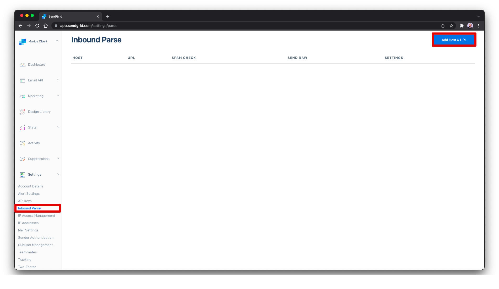

# Template and Cheat Sheet for the 5-Minute-Demo with TypeScript

## Preparations

1. Make sure ngrok and the server aren't running
2. Reset this repository
   ```Bash
   git stash
   git fetch origin
   git checkout main
   git reset --hard origin/master
   ```
3. Prepare the `.env` (based on `test.env`) file with the correct account secrets and the answer
5. Open the [SendGrid Console](https://app.sendgrid.com/)
6. Open the inbox with the proper [folder/label](https://mail.google.com/mail/u/0/#label/SendGrid+Demo)
7. Open the web interface of your DNS provider, e.g. [Namecheap](https://ap.www.namecheap.com/Domains/DomainControlPanel/zero-g.me/advancedns)

## Demo Flow

### Handle incoming emails

1. **Show the entered DNS entries** and where to find the setup instructions for the [CNAME records](https://docs.sendgrid.com/ui/account-and-settings/how-to-set-up-domain-authentication) and the [MX record](https://docs.sendgrid.com/for-developers/parsing-email/setting-up-the-inbound-parse-webhook)
2. Start the server with `yarn dev` and discover the `/hello` endpoint
3. **Import a function from the `fs` package** to `src/server.ts`

   ```TypeScript
   import { appendFileSync } from "fs";
   ```

   and **add a second endpoint**, which adds a new line entry

   ```TypeScript
   .all("/mail", async (request, reply) => {
    appendFileSync("entries.txt", `Entry1# #100\n`);
    reply.code(201);
    reply.send();
   });
   ```

   This won't work out-of-the-box as the server cannot handle the content type yet. To deal with this type, you need to add a form parser for `Content-Type: multipart/form-data` with **a new dependency**.

   ```Bash
   yarn add fastify-formbody
   ```

   ```TypeScript
   import fastifyMultipart from "fastify-multipart";

   server
       .register(FastifyBodyParser)
   ```

   > If needed, you can test this request with:
   >
   > ```
   > ###
   > POST http://localhost:3000/mail
   > Content-Type: multipart/form-data; boundary=----WebKitFormBoundary7MA4YWxkTrZu0gW
   >
   > ------WebKitFormBoundary7MA4YWxkTrZu0gW
   > Content-Disposition: form-data; name="text"
   >
   > title
   > ------WebKitFormBoundary7MA4YWxkTrZu0gW
   > Content-Disposition: form-data; name="text2"
   >
   > title2
   > ------WebKitFormBoundary7MA4YWxkTrZu0gW--
   > ```

4. Start `ngrok` and there the webhook in the console.

   ```Bash
   ngrok http 3000
   # or
   ngrok http -subdomain=<domain> 3000
   ```

5. **Install SendGrid client and the datamask package**

   ```Bash
   yarn add @sendgrid/mail datamask
   ```

   and **import them** on top of the file

   ```TypeScript
   import { MailService } from "@sendgrid/mail";
   import { email } from "datamask";
   ```

   These packages **enhance the webhook** to parse the incoming email, send a reply, and log the information in a privacy-respecting way in the console. Don't forget to replace `<YOUR DOMAIN HERE>` with your authenticated domain.

   ```TypeScript
   .all("/mail", async (request, reply) => {
    const sgBody = request.body as EmailBody;
    const regExFloat = /([0-9]*[.])?[0-9]+/g;

    const guess = sgBody.text.match(regExFloat)[0];
    const sender = JSON.parse(sgBody.envelope).from;

    appendFileSync("entries.txt", `${sender}# #${guess}\n`);

    const msg = {
      to: {
        email: sender,
      },
      from: {
        email: "lottery@<YOUR DOMAIN HERE>",
        name: "SendGrid Demo",
      },
      subject: `RE: ${sgBody.subject}`,
      html: `<h1>Thanks for your Submission!</h1>
      <p>We registered your guess "${guess}" based on the message you sent:</p>
      <p style="margin-left:10%; margin-right:10%;font-style: italic;">${sgBody.text}</p>

      <p>Feel free to send another email if you want to update your guess.</p>

      <p>The submitted data will be only be used for the demo and deleted afterward.</p>`,
    };

    try {
      await sendgridClient.send(msg);
      console.log(`Response has been sent to ${email(sender)}.`);
      reply.code(201);
    } catch (error) {
      console.error(error);
      reply.code(500);
    }

    reply.send();
   });
   ```

   There is currently no type that defines the structure of the webhooks' payload. Let's change this by \*\*adding a new `src/types.d.ts` file:

   ```TypeScript
   type EmailBody = {
       called: any;
       headers: any;
       attachments: any;
       dkim: any;
       subject: any;
       to: any;
       html: any;
       from: any;
       text: any;
       sender_ip: any;
       envelope: any;
       charsets: any;
       SPF: any;
   };
   ```

6. **Register the inbound parse URL** (aka the webhook). You can find a subpage **Inbound Parse** in the SendGrid Settings. Click on the **Add Host & URL** button.
   

   **Select the domain** you previously authenticated and leave the subdomain empty. Now you can enter your ngrok URL as the **Destination URL** and confirm with **Add**.
   
   You should now see the new inbourse parse in the list.

7. Now, the server is ready to handle incoming emails. Send emails that contain a number in the message to `lottery@<YOUR DOMAIN HERE>`. Note that other email addresses of the same domain will also work, but the response will be sent from `lottery@`. Depending on the sending email provider, it might take a few seconds until you see the output in your console.

### Notify all entrants of the final result

1. It's time to evaluate all entries and find the one with the closest estimate. For this, **add a new type** to `src/types.d.ts`:

   ```TypeScript
   type Entry = {
       email: string,
       estimate: number,
       diff: number
   }
   ```

2. **Create a new file `findWinner.ts`** and import the packages you already know from the previous file.

   ```TypeScript
   import { MailService } from "@sendgrid/mail";
   import { readFileSync } from "fs";
   import { email } from "datamask";
   ```

   Read the solution from the `.env` and all entries from the file line-by-line.

   ```TypeScript
   const SOLUTION = +(process.env.SOLUTION || "0"); // later add solution

    const rawEntries = readFileSync("entries.txt").toString();
    const dedupedEntries: { [key: string]: Entry } = {};

    rawEntries.split("\n").forEach((line) => {
    const emailAddress = line.split("# #")[0],
        estimate = +line.split("# #")[1];
    if (emailAddress) {
        dedupedEntries[emailAddress] = {
        email: emailAddress,
        estimate: estimate,
        diff: Math.abs(SOLUTION - estimate),
        };
    }
    });

    let entries = Object.values(dedupedEntries);
   ```

   Sort all entries based on the distance to the correct answer.

   ```TypeScript
   const ranking = entries
    .sort((a, b) => a.diff - b.diff)
    .map((entry, idx) => `${idx + 1}.\t${email(entry.email)}\t${entry.estimate}`)
    .join("\n");
   ```

   To finish this file, initialize the SendGrid client with the API key and send one email to each entrant containing all the estimates (while masking the original email addresses of the participants).

   ```TypeScript
    const sendgridClient = new MailService();
    sendgridClient.setApiKey(process.env.SENDGRID_API_KEY || "");

    entries.forEach(async (entry) => {
    await sendgridClient.send({
        to: {
        email: entry.email,
        },
        from: {
        email: "lottery@<YOUR DOMAIN HERE>",
        name: "SendGrid Demo",
        },
        templateId: "<TEMPLATE ID>",
        dynamicTemplateData: {
        ranking,
        answer: process.env.SOLUTION,
        },
    });
    console.log(`Notified ${email(entry.email)}`);
    });
   ```

3. You probably noticed that this email is not a simple text-mail as before. This snippet makes use of a template that does not yet exist. Build it with the SendGrid web application. Select **Create a Dynamic Template** from the panel and provide any name.

   

   You can see the template and a template ID have been created. **Use this ID in the `findWinner.ts` file** before clicking **Add Version**.

   

   When prompted, select the **Blank Template**

   

   In this editor, you can design your own template via drag-and-drop. Alternatively, you can make use this pre-build template [DynamicTemplate.html](./DynamicTemplate.html)

   

4. **Run `yarn dev:findWinner`** to send the email with the final results to all attendees.

## Congrats

[](https://giphy.com/gifs/reactionseditor-reaction-26u4lOMA8JKSnL9Uk)
